<h1 style="color:#e16a1f;">LockedIn User Guide</h1>

LockedIn is a desktop app for **Computer Science undergraduates applying for internships**. It helps you keep track of applications, roles, links, statuses, and notes in one place.

LockedIn is optimized for users who prefer typing commands. If you are comfortable with keyboard-driven workflows, LockedIn helps you manage applications faster while reducing context switching between job portals, spreadsheets, and email threads.

<!-- * Table of Contents -->

<page-nav-print />

---

## About LockedIn

 

<h3 style="font-size: 1.3em; color: #d9730d; margin-top: 1.2em; margin-bottom: 0.4em;">
Who LockedIn is for
</h3>

LockedIn is designed for Computer Science undergraduates who:

* apply to many internships at once
* want to track applications across different companies and portals
* prefer fast keyboard-based input
* want one place to record important application details

 

<h3 style="font-size: 1.3em; color: #d9730d; margin-top: 1.2em; margin-bottom: 0.4em;">
What LockedIn helps you do
</h3>

LockedIn helps you:

* record internship applications
* store company names and role titles
* save application links for quick access
* track the current stage of each application
* add notes such as reminders, interview details, or deadlines
* search for applications by company, role, application date, date range, or status
* update entries quickly as applications progress

 

<h3 style="font-size: 1.3em; color: #d9730d; margin-top: 1.2em; margin-bottom: 0.4em;">
What LockedIn does not do
</h3>

LockedIn does **not**:

* submit job applications for you
* sync directly with job portals or email inboxes
* automatically detect application updates
* generate analytics or summaries of your applications

It is a fast CLI-based logbook for managing internship applications.

 

---

## Quick Start

 

Follow these steps to get LockedIn running.

<h3 style="font-size: 1.3em; color: #d9730d; margin-top: 1.2em; margin-bottom: 0.4em;">
1. Install Java
</h3>

Ensure that Java `17` or above is installed on your computer.

**Mac users:** Ensure that you use the precise JDK version prescribed [here](https://se-education.org/guides/tutorials/javaInstallationMac.html).

---

<h3 style="font-size: 1.3em; color: #d9730d; margin-top: 1.2em; margin-bottom: 0.4em;">
2. Download LockedIn
</h3>

Download the latest `.jar` file from the [LockedIn release page](https://github.com/AY2526S2-CS2103T-W12-2/tp/releases).

---

<h3 style="font-size: 1.3em; color: #d9730d; margin-top: 1.2em; margin-bottom: 0.4em;">
3. Choose a folder for LockedIn
</h3>

Copy the `.jar` file to the folder you want to use as the *home folder* for LockedIn.

---

<h3 style="font-size: 1.3em; color: #d9730d; margin-top: 1.2em; margin-bottom: 0.4em;">
4. Open LockedIn
</h3>

Open a terminal in that folder and run:

`java -jar lockedin.jar`

> If your downloaded file has a different name, replace `lockedin.jar` with the actual file name.

A GUI similar to the one below should appear in a few seconds. The app starts with sample data so that you can see how LockedIn works.

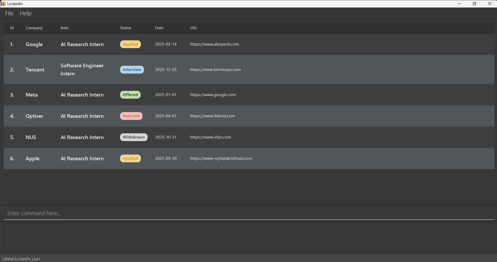

---

<h3 style="font-size: 1.3em; color: #d9730d; margin-top: 1.2em; margin-bottom: 0.4em;">
5. Enter a command
</h3>

Type a command in the command box and press Enter to run it.

Here are a few commands you can try:

* `list`
  Shows all saved applications.

* `add c/Google r/Software Engineer Intern d/2025-02-14 u/https://careers.google.com s/Applied`
  Adds a new application.

* `note 1 Submitted resume through referral`
  Adds a note to the 1st displayed application.

* `delete 3`
  Deletes the 3rd application shown in the current list.

* `help`
  Opens the help window.

 

---

## Features

 

<h3 style="font-size: 1.3em; color: #d9730d; margin-top: 1.2em; margin-bottom: 0.4em;">
Notes about the command format
</h3>

<box type="info" seamless>

**How to read command formats**

* Words in `UPPER_CASE` are values to be supplied by the user.
  Example: in `add c/COMPANY`, `COMPANY` can be used as `Google`.

* Items in square brackets are optional.
  Example: `c/COMPANY [u/URL]` can be used as `c/Google u/https://careers.google.com` or as `c/Google`.

* Parameters can be entered in any order unless stated otherwise.
  Example: if the command specifies `c/COMPANY r/ROLE`, `r/ROLE c/COMPANY` is also accepted.

* **Commands that ignore extra arguments:** `help`, `list`, `exit` treat extra words as insignificant.
  Example: `help 123` is treated as `help`.

* **Strict commands that reject extra arguments:** `clear`, `drop` will show an error if any arguments are provided.
  Example: `clear 4` will show an error message.

* Leading and trailing spaces around field values are ignored.
  Example: `add c/  Google   r/  Software Engineer  ` is treated the same as `add c/Google r/Software Engineer`.

* If you are using a PDF version of this document, be careful when copying commands that wrap across multiple lines. Spaces around line breaks may be omitted when pasted into the app.

</box>

<box type="info" seamless>

**Valid characters for company, role, and note**

LockedIn accepts:

* English letters (`A-Z`, `a-z`)
* digits (`0-9`)
* spaces
* these symbols:
  `` ` ~ ! @ # $ % ^ & * ( ) - _ = + [ { ] } \ | ; : ' " , < . > / ? ``

Characters outside this set are rejected.

</box>

<box type="warning" seamless>

**About non-ASCII characters and decorative fonts**

LockedIn currently validates company names, role names, and notes using a fixed ASCII-only character set. This means non-ASCII characters from non-Latin scripts, decorative fonts, emojis, and many non-English characters may be rejected or behave differently from normal English text.

For best results, use standard English letters, digits, spaces, and the supported symbols listed above.

</box>

<box type="tip" seamless>

**Tip:**
You can press the `Up` and `Down` arrow keys in the command box to browse previously entered commands in the current session.

</box>

---

<h3 style="font-size: 1.3em; color: #d9730d; margin-top: 1.2em; margin-bottom: 0.4em;">
Add an application: <code>add</code>
</h3>

Adds a new application to LockedIn.

| Before                             | After                            |
| ---------------------------------- | -------------------------------- |
| 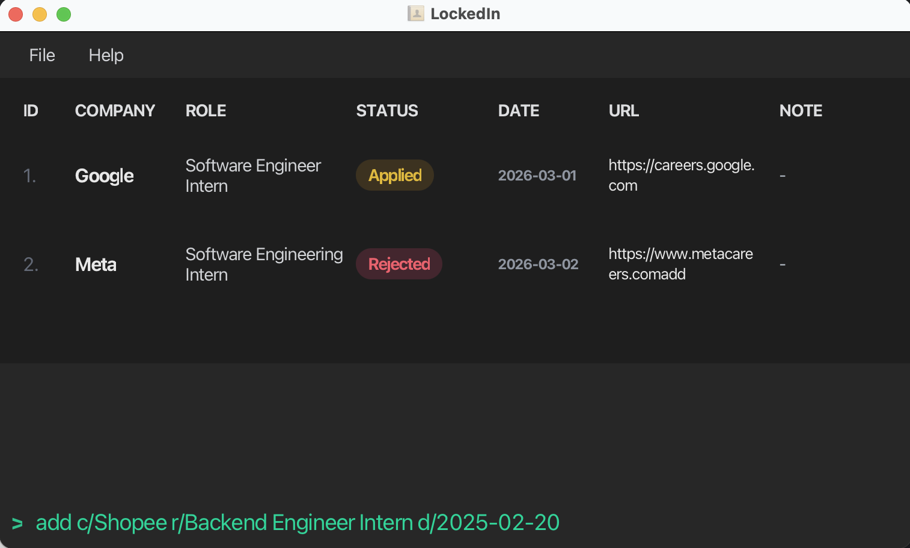 | 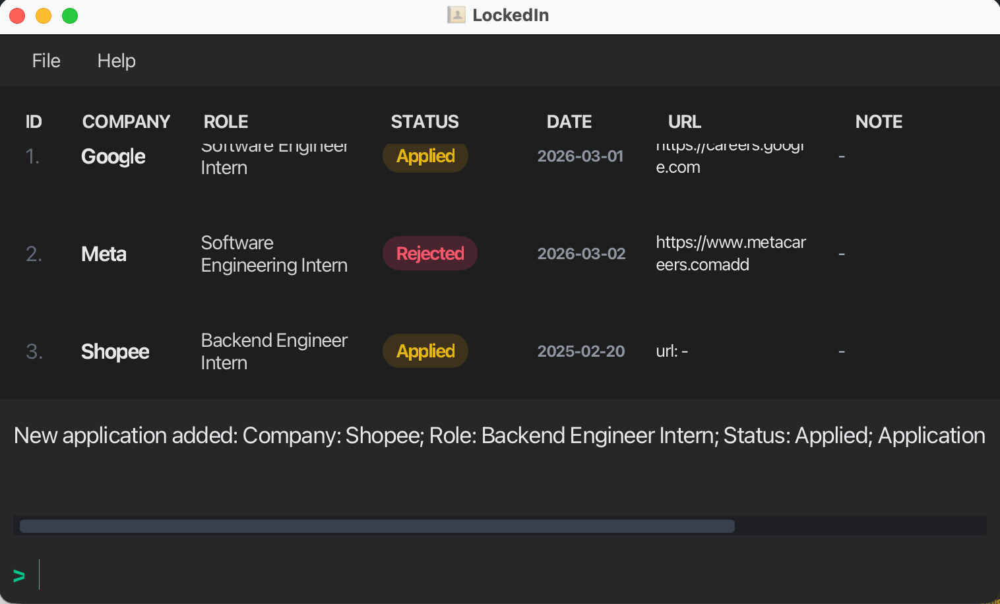 |

**Format:** `add c/COMPANY r/ROLE [d/APPLICATION_DATE] [u/URL] [s/STATUS]`

**Field meaning**

* `COMPANY` — company name
* `ROLE` — position title
* `APPLICATION_DATE` — the date when you applied
* `URL` — application link or portal link
* `STATUS` — current application stage

**Notes**

* `COMPANY` and `ROLE` must not be blank.
* `COMPANY` and `ROLE` may contain only [supported characters](#supported-characters).
* `COMPANY` must be at most 100 characters long.
* `ROLE` must be at most 100 characters long.
* Company and role comparisons are case-insensitive. For example, `Google` and `GOOGLE` are treated as the same company.
* `APPLICATION_DATE` must be a valid date in the format `yyyy-MM-dd`.
* If `d/APPLICATION_DATE` is omitted, LockedIn uses the current date by default.
* `URL`, if provided, must start with `http://` or `https://`, must not be blank, and must not contain spaces.
* Status input is case-insensitive. For example, `s/applied`, `s/Applied`, and `s/APPLIED` are all accepted.
* If `s/STATUS` is omitted, LockedIn uses `Applied` by default.
* Duplicate applications have the same company, role, and application date. LockedIn rejects duplicate applications.

**Examples**

* `add c/Google r/Software Engineer Intern d/2025-02-14`
* `add c/OpenAI r/Research Intern d/2025-03-01 u/https://jobs.openai.com s/Interview`
* `add c/Shopee r/Backend Intern d/2025-02-20 u/https://careers.shopee.sg`

**What you should expect**

* A success message appears.
* The new application is added to the list.

---

<h3 style="font-size: 1.3em; color: #d9730d; margin-top: 1.2em; margin-bottom: 0.4em;">
Edit an application: <code>edit</code>
</h3>

Edits an existing application in LockedIn.

| Before                               | After                              |
| ------------------------------------ | ---------------------------------- |
| 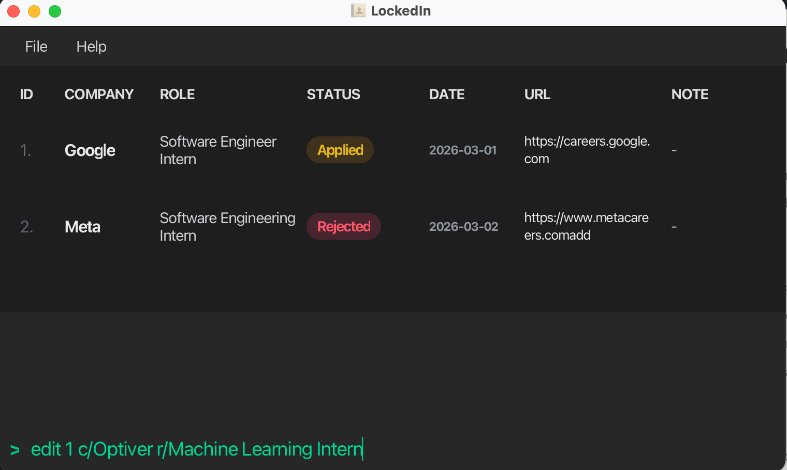 | 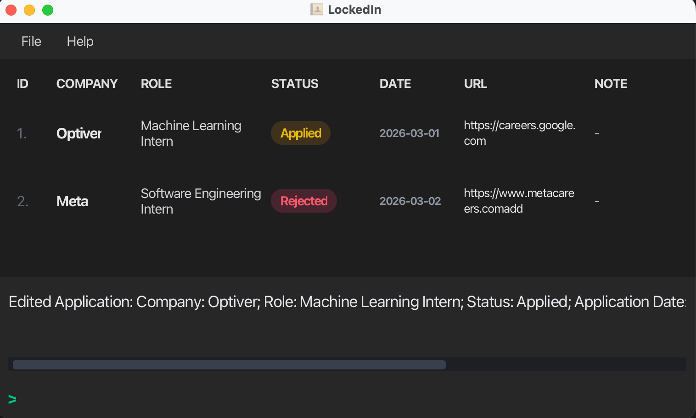 |

**Format:** `edit INDEX [c/COMPANY] [r/ROLE] [d/APPLICATION_DATE] [u/URL] [s/STATUS]`

**Notes**

* `INDEX` refers to the index number shown in the displayed application list.
* `INDEX` must be a positive integer.
* You must provide at least one field to edit.
* Existing values are updated to the input values.
* `COMPANY` and `ROLE`, if provided, cannot be blank.
* `COMPANY` and `ROLE`, if provided, may contain only [supported characters](#supported-characters).
* `COMPANY`, if provided, must be at most 100 characters long.
* `ROLE`, if provided, must be at most 100 characters long.
* `APPLICATION_DATE`, if provided, must be a valid date in the format `yyyy-MM-dd`.
* `URL`, if provided, must start with `http://` or `https://`, must not be blank, and must not contain spaces.
* `STATUS`, if provided, must be one of: `Applied`, `OA`, `Interview`, `Offered`, `Rejected`, `Withdrawn`.
* `STATUS` input is case-insensitive. For example, `s/offered`, `s/Offered`, and `s/OFFERED` are all accepted.
* If the edited values make the application a duplicate of an existing one, the edit is rejected.

**Examples**

* `edit 1 r/Software Engineer d/2025-03-10`
* `edit 2 c/OpenAI s/Offered`
* `edit 3 u/https://careers.example.com s/OA`

**What you should expect**

* A success message appears.
* The selected application is updated.

---

<h3 style="font-size: 1.3em; color: #d9730d; margin-top: 1.2em; margin-bottom: 0.4em;">
Delete an application: <code>delete</code>
</h3>

Deletes the specified application from LockedIn.

| Before                                   | After                                  |
| ---------------------------------------- | -------------------------------------- |
|  | 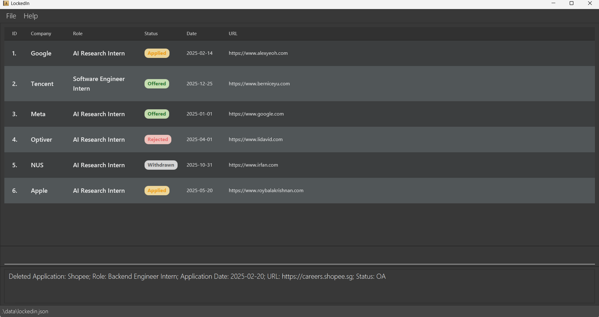 |

**Format:** `delete INDEX`

**Notes**

* `INDEX` refers to the index number shown in the displayed list.
* `INDEX` must be a positive integer.

**Examples**

* `delete 2`
* `find c/Google` followed by `delete 1`

**What you should expect**

* The selected application is removed from the list.

---

<h3 style="font-size: 1.3em; color: #d9730d; margin-top: 1.2em; margin-bottom: 0.4em;">
Find applications: <code>find</code>
</h3>

Finds applications whose company names, roles, application dates, URLs, or statuses match the given filters.
For date fields, it can either find exact dates or find dates within a range (inclusive).

| Before                               | After                              |
| ------------------------------------ | ---------------------------------- |
| 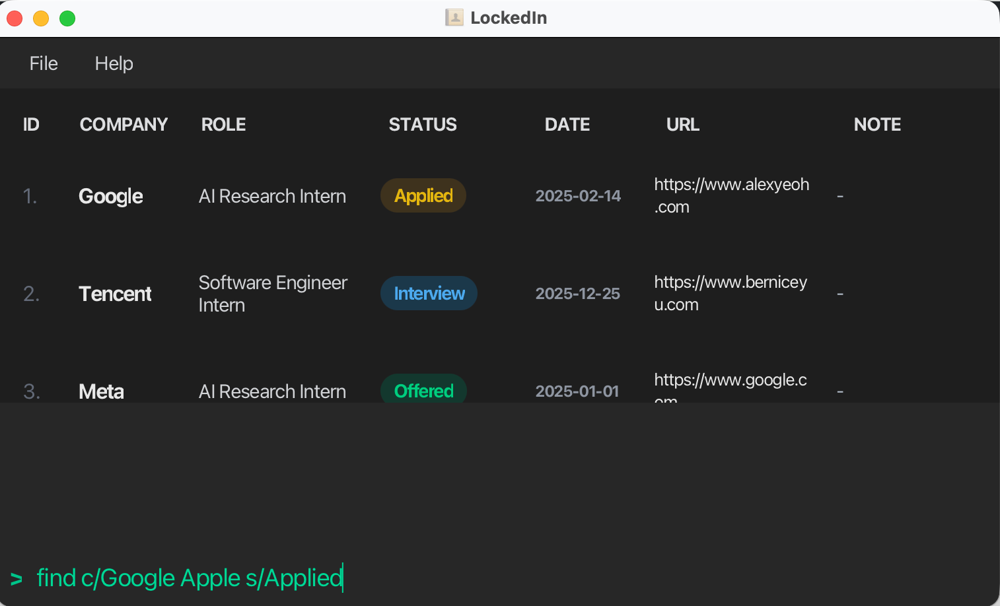 | 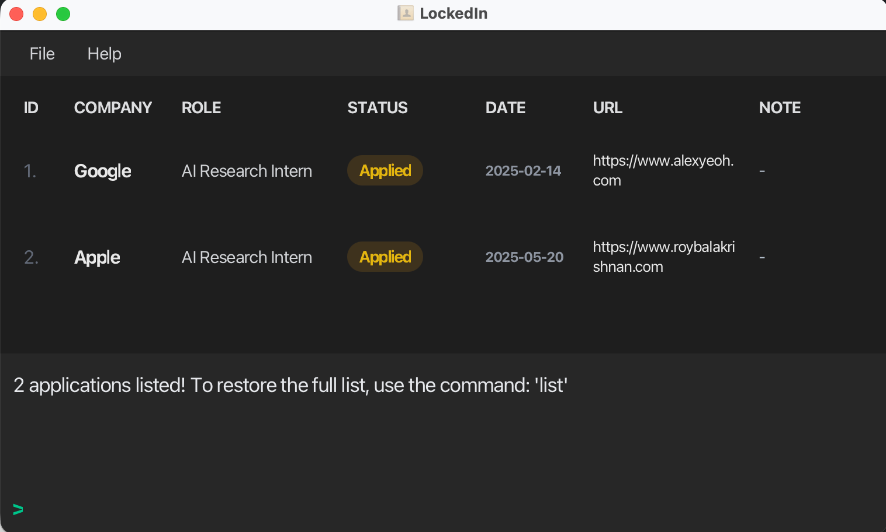 |

**Format:** `find [c/COMPANY] [r/ROLE] [d/DATE_OR_DATE_RANGE] [u/URL] [s/STATUS]`

**Date formats supported**

* Exact date: `d/2025-03-14`
* Date range: `d/2025-03-01:2025-03-31`

**Notes**

* You must provide at least one field.
* You cannot provide an empty parameter. A prefix must be followed by at least one keyword (e.g. `find c/` is invalid).
* The search is case-insensitive.
  Example: `c/google` matches `Google`.
* Status keywords are also case-insensitive. For example, `find s/applied` and `find s/APPLIED` are both valid.
* For company, role, URL, and status, applications matching at least one keyword in the same field are returned.
* For URL fields, the keyword must match exactly as stored, including characters such as trailing slashes (`/`). For example, `https://www.example.com` does not match `https://www.example.com/`. This exact-match behavior is by design to ensure precise URL identification in the application database.
* If multiple fields are specified, applications must match all those fields.
* `d/START_DATE:END_DATE` returns applications whose application dates fall within the range, inclusive.
* `START_DATE` must be earlier than or equal to `END_DATE`.
* All dates must be valid and must follow the format `yyyy-MM-dd`.

**Examples**

* `find c/Google`
* `find r/Intern`
* `find c/Google r/Intern`
* `find u/https://www.google.com/`
* `find s/Applied`
* `find d/2025-03-14`
* `find d/2025-03-01:2025-03-31`
* `find c/TikTok d/2025-02-01:2025-02-28 s/Interview`

**What you should expect**

* The application list updates to show only matching entries.
* The success message shows the number of applications found and hints you can use `list` to restore the full list.

<box type="tip" seamless>

**Tip:**
After using `find`, use `list` to return to the full application list.

</box>

---

<h3 style="font-size: 1.3em; color: #d9730d; margin-top: 1.2em; margin-bottom: 0.4em;">
List all applications: <code>list</code>
</h3>

Shows all applications in LockedIn.

| Before                               | After                              |
| ------------------------------------ | ---------------------------------- |
| 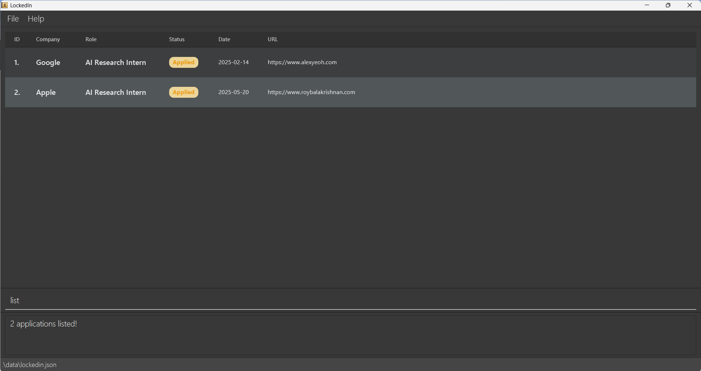 | 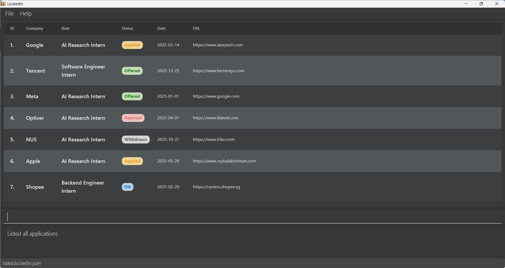 |

**Format:** `list`

**What you should expect**

* The full application list is shown again.
* This is useful after using `find` to return to the full list.

---

<h3 style="font-size: 1.3em; color: #d9730d; margin-top: 1.2em; margin-bottom: 0.4em;">
Add or replace a note: <code>note</code>
</h3>

Adds or replaces the note of an existing application.

**Format:** `note INDEX NOTE`

| Before                                | After                                   |
| ------------------------------------ | --------------------------------------- |
|  |  |

**Notes**

* `INDEX` refers to the index number shown in the displayed list.
* `INDEX` must be a positive integer.
* `NOTE` does **not** use a prefix.
* `NOTE` must not be blank.
* `NOTE` may contain only [supported characters](#supported-characters).
* `NOTE` must be at most 500 characters long.
* If the selected application already has a note, the old note is replaced.
* Notes can be used to store reminders, interview details, recruiter names, deadlines, or any other application-related information.

**Examples**

* `note 1 Submitted resume through referral`
* `note 2 OA deadline is 2025-03-15`
* `note 3 Recruiter mentioned response within 2 weeks`

**What you should expect**

* A success message appears.
* The selected application's note is updated.

---

<h3 style="font-size: 1.3em; color: #d9730d; margin-top: 1.2em; margin-bottom: 0.4em;">
Clear an application note: <code>clearnote</code>
</h3>

Clears the note of the specified application.

| Before                                         | After                                        |
| ---------------------------------------------- | -------------------------------------------- |
|  |  |

**Format:** `clearnote INDEX`

**Notes**

* `INDEX` refers to the index number shown in the displayed list.
* `INDEX` must be a positive integer.
* The selected application's note is reset to an empty note.
* If the selected application has an empty note, LockedIn shows an error message.

**Examples**

* `clearnote 1`
* `find c/Google` followed by `clearnote 1`

**What you should expect**

* The selected application's note is cleared.
* A success message appears.

---

<h3 style="font-size: 1.3em; color: #d9730d; margin-top: 1.2em; margin-bottom: 0.4em;">
Copy an application URL: <code>copy</code>
</h3>

Copies the URL of an application to your system clipboard.

| Before                               | After                              |
| ------------------------------------ | ---------------------------------- |
| 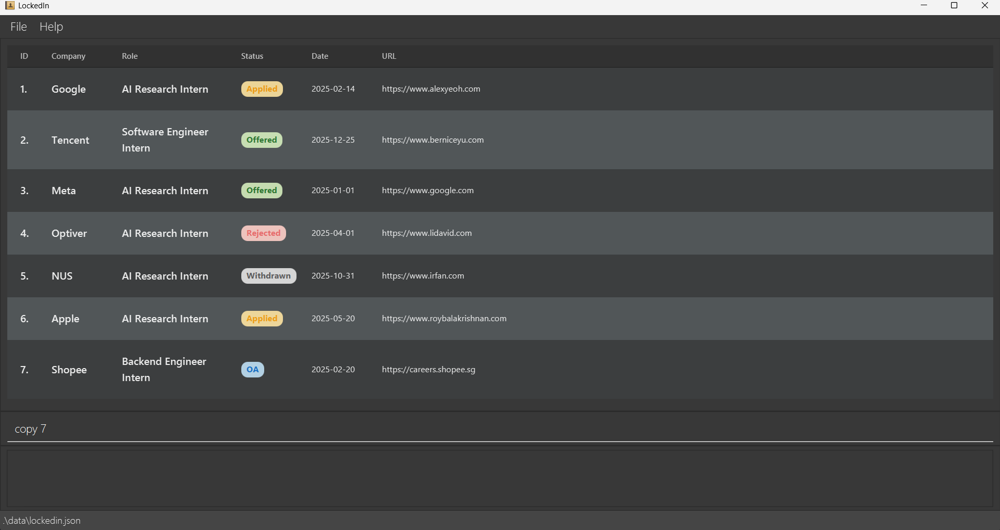 | 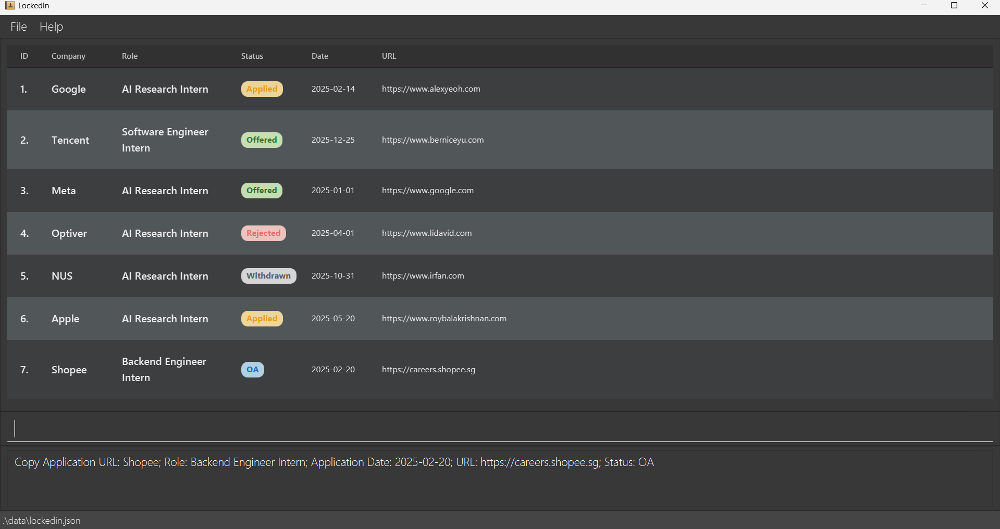 |

**Format:** `copy INDEX`

**Notes**

* `INDEX` refers to the index number shown in the displayed list.
* `INDEX` must be a positive integer.
* The selected application must already contain a URL.
* If the selected application has no URL, LockedIn shows an error message.

**Examples**

* `copy 1`
* `find c/Google` followed by `copy 1`

**What you should expect**

* If the selected application has a URL, LockedIn copies it to your clipboard.

---

<h3 style="font-size: 1.3em; color: #d9730d; margin-top: 1.2em; margin-bottom: 0.4em;">
Move an application to the next stage: <code>next</code>
</h3>

Moves an application to the next stage in the application workflow.

| Before                               | After                              |
| ------------------------------------ | ---------------------------------- |
| 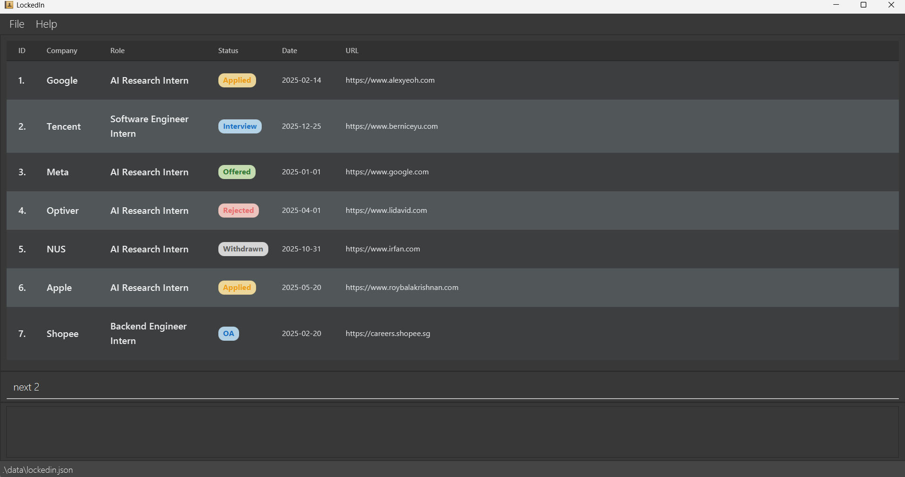 | 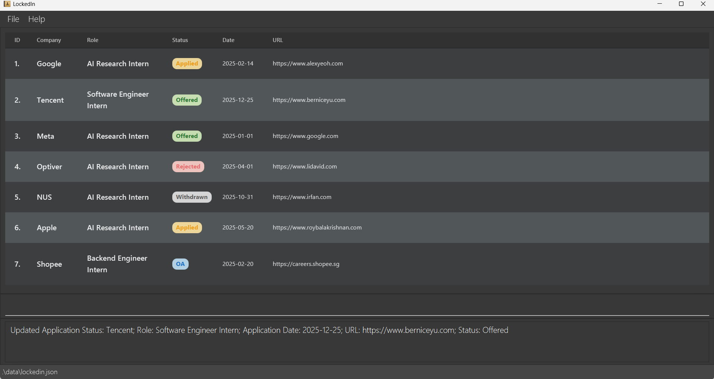 |

**Format:** `next INDEX`

**Notes**

* `INDEX` refers to the index number shown in the displayed list.
* `INDEX` must be a positive integer.
* LockedIn updates the selected application to the next stage in the status sequence.
* If you are viewing a filtered list, the filter is preserved after the command executes.

**Current status sequence**
`Applied -> OA -> Interview -> Offered -> Rejected -> Withdrawn -> Applied`

**Examples**

* `next 1`
* `list` followed by `next 3`

**What you should expect**

* The selected application's status changes to the next stage.

<box type="tip" seamless>

**Tip:**
`next` follows a fixed sequence. If you want to set a specific status directly, use `edit INDEX s/STATUS` instead.

</box>

---

<h3 style="font-size: 1.3em; color: #d9730d; margin-top: 1.2em; margin-bottom: 0.4em;">
Drop rejected or withdrawn applications: <code>drop</code>
</h3>

Deletes applications with `Rejected` or `Withdrawn` status from the current displayed list.

| Before                               | After                              |
|--------------------------------------|------------------------------------|
|  |  |

**Format:** `drop`

**Notes**

* The `drop` command does not accept any arguments.
* Only applications in the current filtered list with terminal statuses are deleted.

**What you should expect**

* Applications with `Rejected` and `Withdrawn` status from the current displayed list are removed.
* A message shows how many applications were dropped and lists them.

---

<h3 style="font-size: 1.3em; color: #d9730d; margin-top: 1.2em; margin-bottom: 0.4em;">
Give an alias to a command word: <code>alias</code>
</h3>

Creates a shortcut for an existing command word.

**Format:** `alias ALIAS COMMAND_WORD`

**Notes**

* `ALIAS` must be a single word.
* `COMMAND_WORD` must be an existing built-in command word.
* `ALIAS` cannot be an existing built-in command word.
* If an alias already exists, it is updated to point to the new command word.

**Examples**

* `alias ls list`
* `alias rm delete`

**What you should expect**

* You can use the alias in place of the original command word.
* Example: after `alias ls list`, entering `ls` will run `list`.
* The app informs you when an existing alias has been overwritten.

---

<h3 style="font-size: 1.3em; color: #d9730d; margin-top: 1.2em; margin-bottom: 0.4em;">
Remove an alias: <code>unalias</code>
</h3>

Removes an existing alias.

**Format:** `unalias ALIAS`

**Examples**

* `unalias ls`

**What you should expect**

* The alias is removed.
* After `unalias ls`, entering `ls` will no longer work unless you create it again.

---

<h3 style="font-size: 1.3em; color: #d9730d; margin-top: 1.2em; margin-bottom: 0.4em;">
List all saved aliases: <code>alias-list</code>
</h3>

Displays all currently saved aliases.

| Before                                         | After                                        |
| ---------------------------------------------- | -------------------------------------------- |
|  |  |

**Format:** `alias-list`

**Examples**

* `alias-list`

**What you should expect**

* All saved aliases are shown in the response box.
* Each alias is displayed in the format `ALIAS -> COMMAND_WORD`.
* If there are no saved aliases, a message is shown.

---

<h3 style="font-size: 1.3em; color: #d9730d; margin-top: 1.2em; margin-bottom: 0.4em;">
Clear applications: <code>clear</code>
</h3>

Deletes all applications from the current displayed list.

| Before                                 | After                                |
| -------------------------------------- | ------------------------------------ |
| 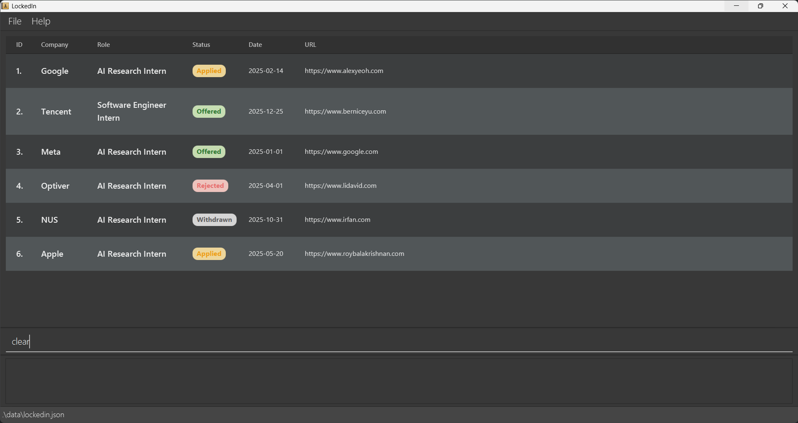 | 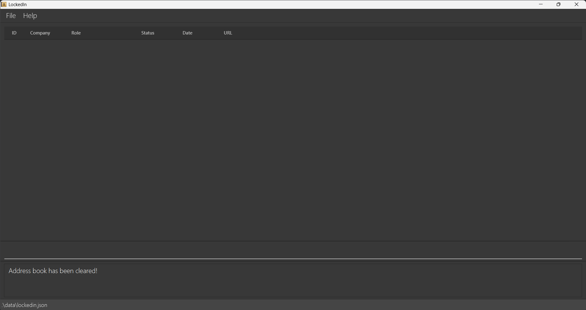 |

**Format:** `clear`

**Notes**

* The `clear` command does not accept any arguments.
* Only applications in the current filtered list are deleted.
* If you are viewing all applications using `list`, all applications are deleted.
* If you are viewing a filtered subset using `find`, only those displayed applications are deleted.

**What you should expect**

* Applications from the current displayed list are removed.
* A message shows how many applications were cleared and lists them.

<box type="warning" seamless>

**Warning:**
This command removes all applications from the current displayed list. Use it carefully.

</box>

<box type="tip" seamless>

**Tip:**
If you want to remove all applications in LockedIn, first run `list` to show all applications, then run `clear`.

</box>

---

<h3 style="font-size: 1.3em; color: #d9730d; margin-top: 1.2em; margin-bottom: 0.4em;">
View help: <code>help</code>
</h3>

Opens the help window.

**Format:** `help`

**What you should expect**

* A help window appears, with a User Guide link available for copying.

---

<h3 style="font-size: 1.3em; color: #d9730d; margin-top: 1.2em; margin-bottom: 0.4em;">
Exit the program: <code>exit</code>
</h3>

**Format:** `exit`

**What you should expect**

* The window closes.

 

---

## Saving and Editing Data

 

<h3 style="font-size: 1.3em; color: #d9730d; margin-top: 1.2em; margin-bottom: 0.4em;">
Saving data
</h3>

LockedIn's data is saved automatically after any command that changes the data.

You do not need to save manually.

 

<h3 style="font-size: 1.3em; color: #d9730d; margin-top: 1.2em; margin-bottom: 0.4em;">
Editing the data file
</h3>

LockedIn's data is stored in:

`[JAR file location]/data/lockedin.json`

Advanced users may update data directly by editing that file.

<box type="warning" seamless>

**Caution:**
If your changes make the data file invalid, LockedIn may discard the data and start with an empty data file the next time it runs.

Before editing the data file:

* make a backup copy first
* keep the JSON format valid
* edit the file only if you are confident you understand the format

</box>

 

---

## FAQ

 

**Q: Can I use emoji or non-English characters in company, role, or note fields?** 
A: No. LockedIn currently supports only English letters, digits, spaces, and a [fixed set of symbols](#supported-characters) for those fields.

 

**Q: Why do certain characters not work properly?** 
A: LockedIn validates the company, role, and note fields using an ASCII-only character set. Non-ASCII characters (including those from non-Latin scripts and decorative fonts) may be rejected. Only the [supported character set](#supported-characters) is reliably accepted.

 

**Q: What date format should I use?** 
A: Use the format `yyyy-MM-dd`. For example, `2025-02-14`.

 

**Q: What does `INDEX` mean?** 
A: `INDEX` is the number shown next to an application in the current displayed list. Use it for commands such as `edit`, `delete`, `next`, `copy`, `note`, and `clearnote`.

 

**Q: Why does my command not work?** 
A: Check the command format carefully. Common mistakes include:

* using [unsupported characters](#supported-characters)
* exceeding the character limit
* using the wrong date format
* entering an invalid index
* forgetting a required prefix such as `c/` or `r/`
* omitting required fields

 

**Q: Why can’t I copy a URL?** 
A: The selected application may not have a URL saved. Add one first using `edit INDEX u/URL`.

 

**Q: How do I return to the full application list after using `find`?** 
A: Use the `list` command.

 

**Q: What statuses can an application have?** 
A: LockedIn currently uses these statuses: `Applied`, `OA`, `Interview`, `Offered`, `Rejected`, and `Withdrawn`.

 

**Q: What makes two applications duplicates?** 
A: Two applications are duplicates if they have the same company, role, and application date. URL, status, and note do not affect duplicate detection.

 

**Q: What is the difference between `delete`, `clear`, and `drop`?** 
A:

* `delete INDEX` removes one application.
* `clear` removes all applications in the current displayed list.
* `drop` removes only displayed applications with `Rejected` or `Withdrawn` status.

 

**Q: How do I move my data to another computer?** 
A: Install LockedIn on the other computer and replace the empty data file it creates with the data file from your current LockedIn home folder.

 

---

## Known Issues

 

##### 1. Application opens off-screen after switching displays

**Problem:**
When using multiple screens, the application window may be placed on a secondary screen. If you later switch back to using only the primary screen, the GUI may open off-screen.

**Solution:**
Delete the `preferences.json` file before starting the application again.

##### 2. Help window does not appear after being minimized

**Problem:**
If the Help window is minimized and you run `help` again:

* the existing Help window may stay minimized
* no new Help window may be shown

**Solution:**
Manually restore the minimized Help window.

 

---

## Command Summary

 

| Action         | Format                                                                    | Example                                                |
| -------------- | ------------------------------------------------------------------------- | ------------------------------------------------------ |
| **Add**        | `add c/COMPANY r/ROLE [d/APPLICATION_DATE] [u/URL] [s/STATUS]`            | `add c/Google r/Software Engineer Intern d/2025-02-14` |
| **Alias**      | `alias ALIAS COMMAND_WORD`                                                | `alias ls list`                                        |
| **Alias List** | `alias-list`                                                              | `alias-list`                                           |
| **Clear**      | `clear`                                                                   | `clear`                                                |
| **Clear Note** | `clearnote INDEX`                                                         | `clearnote 1`                                          |
| **Copy**       | `copy INDEX`                                                              | `copy 3`                                               |
| **Delete**     | `delete INDEX`                                                            | `delete 3`                                             |
| **Drop**       | `drop`                                                                    | `drop`                                                 |
| **Edit**       | `edit INDEX [c/COMPANY] [r/ROLE] [d/APPLICATION_DATE] [u/URL] [s/STATUS]` | `edit 2 c/OpenAI s/Offered`                            |
| **Exit**       | `exit`                                                                    | `exit`                                                 |
| **Find**       | `find [c/COMPANY] [r/ROLE] [d/DATE_OR_DATE_RANGE] [u/URL] [s/STATUS]`     | `find c/Google d/2025-03-01:2025-03-31`                |
| **Help**       | `help`                                                                    | `help`                                                 |
| **List**       | `list`                                                                    | `list`                                                 |
| **Next**       | `next INDEX`                                                              | `next 3`                                               |
| **Note**       | `note INDEX NOTE`                                                         | `note 1 OA deadline is 2025-03-15`                     |
| **Unalias**    | `unalias ALIAS`                                                           | `unalias ls`                                           |
